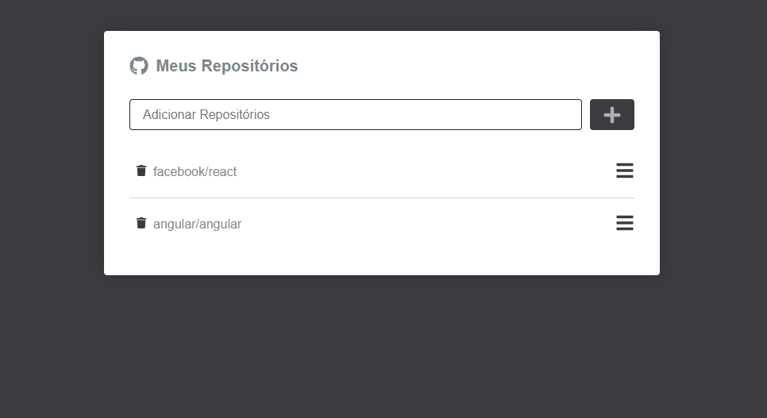

### REPOSITORIES
<h1 align='center'>
  
</h1>

  

  <a href="#interrobang-what-is-inter">About</a>&nbsp;&nbsp;&nbsp;|&nbsp;&nbsp;&nbsp;
  <a href="#technologies">Technologies used</a>&nbsp;&nbsp;&nbsp;|&nbsp;&nbsp;&nbsp;
  <a href="#construction_worker-how-to-use-developing">How to portfolio</a>&nbsp;&nbsp;&nbsp;|&nbsp;&nbsp;&nbsp;
  <a href="#key-license">License</a>

<!-- <h1 align="center">
  
</h1> -->

### Premium Partners

This Front-End project was developed using the following technologies:

-   [Typescript][typescript]
-   [styled-components][sass]
-   [React Icons][react-icons]
-   [React Router dom][react-router-dom]
<!-- -   [react Toastify][react-toastify] -->

  Made with 💚  by <strong>Jefferson Charlles</strong> 🔥
  <a href='https://www.linkedin.com/in/jeffersoncharlles/'>Get in touch!</a>

## License

[typescript]: https://www.typescriptlang.org/
[react-router-dom]: https://reactrouter.com/docs/en/v6
[sass]: https://sass-lang.com/
[react-icons]: https://react-icons.github.io/react-icons/
[react-toastify]: https://fkhadra.github.io/react-toastify/
[git]: https://git-scm.com
[license]: ./LICENSE
[linkedin]: https://www.linkedin.com/in/jeffersoncharlles/